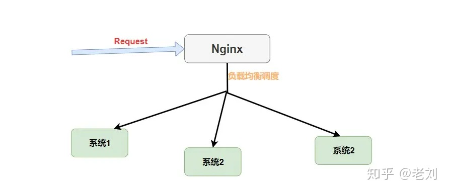
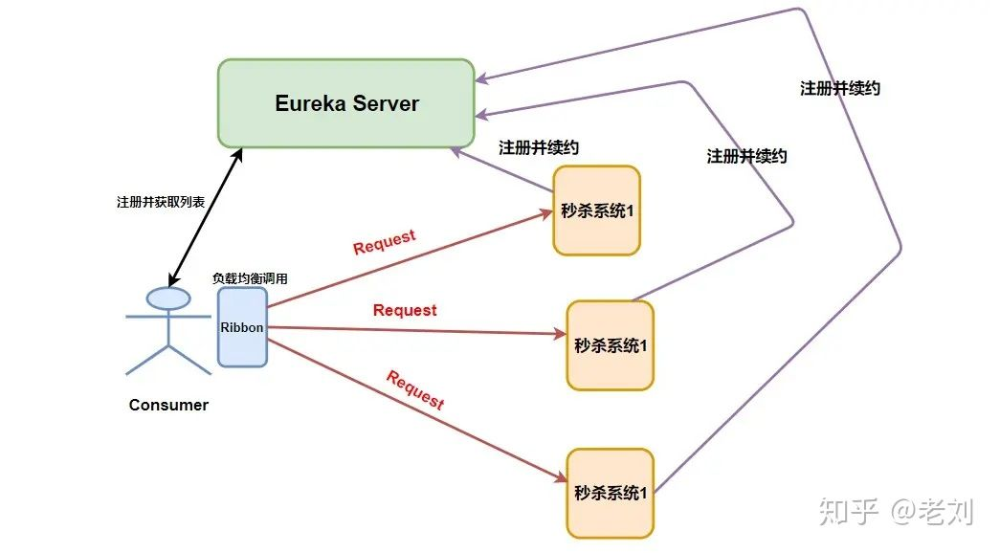

# SpringCloud 常见面试题
## Eureka
### 客户端启动时如何注册到服务端？

Eureka客户端在启动时，首先会创建一个心跳的定时任务，定时向服务端发送心跳信息，HeartbeatThread线程调用renew()方法，服务端会对客户端心跳做出响应，如果响应状态码为404时，表示服务端没有该客户端的服务信息，那么客户端则会向服务端发送注册请求，注册信息包括服务名、ip、端口、唯一实例ID等信息。

### 服务端如何保存客户端服务信息？

客户端通过register()方法将服务实例信息发送到服务端，在register方法中，将服务实例信息InstanceInfo注册到了register变量中，它其实就是一个ConcurrentHashMap。

### 客户端如何拉取服务端已保存的服务信息

客户端拉取服务端服务信息是通过一个定时任务定时拉取的，每次拉取后刷新本地已保存的信息，需要使用时直接从本地直接获取。

### 如何构建高可用的Eureka集群

搭建高可用的Eureka集群，只需要在注册中心的配置文件中配置其他注册中心的地址

- 注册中心收到注册信息后会判断是否是其他注册中心同步的信息还是客户端注册的信息，如果是客户端注册的信息，那么他将会将该客户端信息同步到其他注册中心去；否则收到信息后不作任何操作。通过此机制避免集群中信息同步的死循环。

replicateToPeers方法字面意思是同步或者复制到同事（即其他对等的注册中心），最后一个参数为isReplication，是一个boolean值，表示是否同步（复制），如果是客户端注册的，那么为false,如果是其他注册中心同步的则为true，replicateToPeers方法中，如果isReplication=false时，将会发起同步

### 心跳和服务剔除机制是什么

心跳：客户端启动后，会启动一个定时任务，定时向服务端上报自己的状态，renew续租，表示自己为可用状态，默认为30秒，可配置

剔除机制：

1. 开启自我保护机制（默认开启，可配置）

   一分钟内收到服务心跳数临界值 = 客户端数量 * （60/心跳时间间隔） * 比率

   如果未失效客户端大于临界值，则剔除掉失效的服务（源码不是一次全部剔除，随机剔除）；小于临界值，则启动自我保护，不做任何操作

2. 关闭自我保护机制

   服务端会定时剔除失效服务

## Ribbon
### Ribbon负载均衡和Nginx的负载均衡有什么不同？
一般实现负载均衡，会有两个选择，客户端负载均衡(进程式负载均衡)和服务端的负载均衡(集中式负载均衡)

* Nginx是服务器端负载均衡，负载均衡的策略算法是在服务器端实现的。


* Ribbon是客户端负载均衡，负载均衡算法是由调用者本身维护的

  
### Ribbon是如何实现失败重试的？
```yaml
spring:
  cloud:
    loadbalancer:
      retry:
        enabled: true #开启重试机制
ribbon:
   ReadTimeout: 6000
   ConnectTimeout: 6000
   MaxAutoRetries: 1
   MaxAutoRetriesNextServer: 2

#服务名
server-provider:
  ribbon:
    ConnectTimeout: 250 #单位ms,请求连接超时时间
    ReadTimeout: 1000 #单位ms,请求处理的超时时间
    OkToRetryOnAllOperations: true #对所有操作请求都进行重试
    MaxAutoRetriesNextServer: 2 #切换实例的重试次数
    MaxAutoRetries: 1 #对当前实例的重试次数
```

### Ribbon与Feign的区别是什么？
